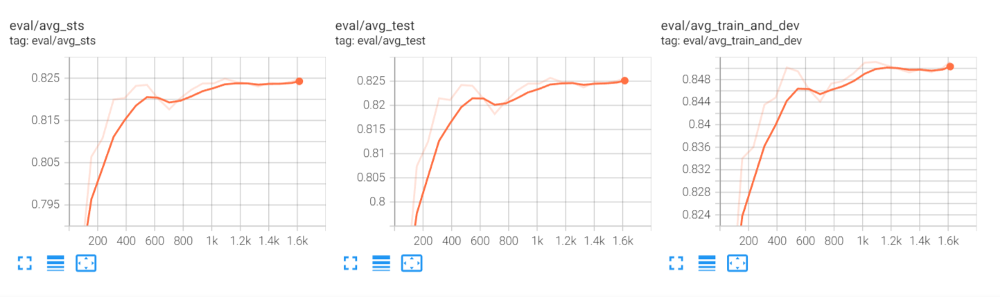

# Gumbel-Softmax + Sentence Embedding
This is a separate repo for a specific part of my undergrad thesis (My undergrad thesis repo is [here](https://github.com/Ja1Zhou/SimCSE_PRO)). I attempt to improve `sentence embeddings` via `discrete optimization`, which is learnt through `Gumbel Softmax`. The performance results are not ideal, yet the `methodology` and `implementation` behind this exploration are worth documenting. 

The `highlights` are:
- Huggingface style `Trainer` + `transformers:v4.22.0` compatibility
- `Discrete Optimization` + `Gumbel-Softmax` method
- More reasonable `evaluation`

## Table of Contents

- [Gumbel-Softmax + Sentence Embedding](#gumbel-softmax--sentence-embedding)
  - [Table of Contents](#table-of-contents)
  - [Reproduction](#reproduction)
    - [Environment](#environment)
    - [Scripts](#scripts)
  - [Gumbel Softmax (original paper)](#gumbel-softmax-original-paper)
    - [Discrete Optimization](#discrete-optimization)
    - [Gumbel-Max](#gumbel-max)
      - [Gumbel Distribution](#gumbel-distribution)
      - [Deriving Gumbel-Max](#deriving-gumbel-max)
    - [Putting It Together](#putting-it-together)
  - [Methodology](#methodology)
  - [Evaluation](#evaluation)
  - [All Results](#all-results)
    - [Why SimCSE Works](#why-simcse-works)
## Reproduction
### Environment
```bash
# for a separate python env
conda create -n hgf python=3.8.13 -y
conda activate hgf
# requirements
pip install -r requirements.txt
# download eval data
cd SentEval/data/downstream
```
### Scripts
```bash
bash scripts/reproduce.sh
# or
bash scripts/gumbel_softmax.sh
# eval scripts are also provided.
# The scripts are highly customizable, with arugments explained in metadata.
```
## Gumbel Softmax [(original paper)](https://arxiv.org/abs/1611.01144)
### Discrete Optimization
Originally, discrete optimization is learnt in RL style through REINFORCE algorithm. 

$$\nabla_\theta\mathbb{E}_z[\mathcal{L}(z)] = \nabla_\theta \int dz\ p_\theta(z)\mathcal{L}(z) = \int dz\ p_\theta(z)\nabla_\theta \log p_\theta(z)\mathcal{L}(z)\\
=\mathbb{E}_z[\mathcal{L}(z)\nabla_\theta \log p_\theta(z)]$$

where $z$ is drawn from a distribution parameterized on $\theta$ and $\theta$ is optimized. The problem lies in `efficienctly sampling` from the distribution during each learning step. Even binary combinations would grow expotentially. Another difficulty is related to `high variance`. The motivation for a better optimization objective is strong. 
### Gumbel-Max
sampling from an arbitrary discrete distribution can be tackled through the `Gumbel-Max` trick, which takes the form of:
$$\argmax_i(\log p_i - \log(-\log\varepsilon_i)),\ \varepsilon_i\ i.i.d.\sim\mathcal{U}(0, 1)$$
It can be prooved that: 
$$P(\argmax_i(\log p_i - \log(-\log\varepsilon_i))==j) = p_j$$
#### Gumbel Distribution
Let us inspect the distribution of 
$$\xi = -\log(-\log\varepsilon),\ \varepsilon\sim\mathcal{U}(0,1)$$
Its density function can be derived as 
$$F(X) = P(\xi \leq X) = P(-\log(-\log\varepsilon)\leq X)\\
= P(-\log \varepsilon \geq \exp(-X)) = P(\varepsilon\leq\exp(-\exp(-X)))\\
=\exp(-\exp(-X))
$$
#### Deriving Gumbel-Max
Denote $\log p_i-\log(-\log\varepsilon_i)$ as $\mathbb{G}(i)$.

$$P(\argmax_i(\log p_i - \log(-\log\varepsilon_i))==j)\\
=\prod_iP(\mathbb{G}(j)\geq\mathbb{G}(i))
$$

We have

$$\mathbb{G}(j)\geq\mathbb{G}(i)\Leftrightarrow\ \log p_i-\log(-\log\varepsilon_i)\geq \log p_j-\log(-\log\varepsilon_j)\\
\\
\Leftrightarrow \frac{p_i}{-\log \varepsilon_i}\leq \frac{p_j}{-\log \varepsilon_j} \Leftrightarrow p_i\log\varepsilon_j\geq p_j\log\varepsilon_i\\
\Leftrightarrow\varepsilon_i\leq\varepsilon_j^{\frac{p_i}{p_j}}
$$

$\Rightarrow$

$$P(\mathbb{G}(j)\geq\mathbb{G}(i)|\varepsilon_j =\hat\varepsilon_j) = \hat\varepsilon_j^{\frac{p_i}{p_j}}
$$

$\Rightarrow$

$$\prod_iP(\mathbb{G}(j)\geq\mathbb{G}(i)|\varepsilon_j =\hat\varepsilon_j) = \hat\varepsilon_j^{\frac{\sum_ip_i}{p_j}} = \hat\varepsilon_j^{\frac{1-p_j}{p_j}}$$
$\Rightarrow$
$$P(\mathbb{G}(j)\geq\mathbb{G}(i)) = \int_0^1 d\hat\varepsilon_j\ \hat\varepsilon_j^{\frac{1-p_j}{p_j}} = p_j\varepsilon^{\frac{1}{p_j}}|_{\varepsilon=0}^1 = p_j$$
Therefore, sampling from arbitrary categorical distribution can be  reparameterized to sampling from Gumbel distribution. 
### Putting It Together
Recall that sampling from arbitrary categorical distribution can be reparameterized as sampling $\varepsilon_i$ from Gumbel distribution. 
$$\argmax_i(\log p_i - \log(-\log\varepsilon_i)),\ \varepsilon_i\ i.i.d.\sim\mathcal{U}(0, 1)$$

To tackle the problem underlying discrete optimization, we would like to approximate `discrete operations` with continuous operations, such that gradients flow back to the parameters that the sampled distribution is conditioned on (Here, $p_i$). 

It is intuitive that by replacing `argmax` with `softmax`, we would obtain a continuous approximation where gradients to distribution parameter $p_i$ are well defined. Moreover, by annealing the temperature to 0, the `softmax` operation would approach `argmax` in both sampled value and expectation value.
## Methodology
For an input sentence $\mathbb{S} = \{s_i\}_{i=1}^{N}$, assume that a proxy model predicts $P(s_i\ \text{should be kept}|\mathbb{S}) = \mathcal{P}(s_i, \mathbb{S})$ for the best performing sentence embedding. The intuition behind is that certain tokens may introduce noise to pooled sentence embeddings. We use a small proxy model for $\mathcal{P}$.

Should a token be deleted from input, the `ATTN` process would be affected. Here, we shrink the `attention_probs` of $s_i$ by multiplying with $\mathcal{P}(s_i, \mathbb{S})$. This is equivalent to performing a `continuous dropout` between $[0, 1]$. 

During inference, we keep tokens with $\mathcal{P}(s_i, \mathbb{S}) >= 0.5$. Should all tokens be discarded, we keep the token with the largest $\mathcal{P}$.

## Evaluation
In the original SimCSE repo, performance is evaluated on `STS` tasks. Interestingly, only the `dev` split of `STSBenchmark` is used for validation during training. Test evaluation is performed on `train` and `test` split. However, considering the semi-supervized nature of SimCSE, it is more natural to combine the `train` split and `dev` split as validation set for less variation. statistics are tracked through `Trainer` and `tensorboard`. Sample from `sup-roberta-base`:

## All Results
Here we report `spearman correlation` results.
|                  | avg_sts    | avg_test   | avg_train_and_dev | sickrelatedness | sts12      | sts13      | sts14      | sts15      | sts16      | stsbenchmark | stsbenchmark_test | stsbenchmark_train_and_dev |
| ---------------- | ---------- | ---------- | ----------------- | --------------- | ---------- | ---------- | ---------- | ---------- | ---------- | ------------ | ----------------- | -------------------------- |
| unsup-bert-GS    | 0.7422     | 0.7394     | 0.7820            | 0.6948          | **0.6505** | 0.7950     | 0.7076     | **0.8034** | 0.7655     | 0.7782       | 0.7592            | 0.7820                     |
| unsup-bert       | **0.7499** | **0.7473** | **0.7822**        | **0.7077**      | 0.6428     | **0.8168** | **0.7226** | 0.8025     | **0.7784** | **0.7785**   | **0.7600**        | **0.7822**                     |
||
| unsup-roberta-GS | 0.7463     | 0.7458     | 0.7863            | 0.6831          | 0.6386     | 0.7931     | 0.7202     | 0.8179     | 0.7861     | 0.7852       | 0.7816            | 0.7863                     |
| unsup-roberta    | **0.7602** | **0.7604** | **0.7955**        | **0.6948**      | **0.6597** | **0.8124** | **0.7339** | **0.8192** | **0.806**  | **0.7954**   | **0.7969**        | **0.7955**                 |
||
| sup-bert-GS      | 0.8148     | 0.8144     | 0.8451            | 0.8095          | 0.7493     | **0.8461** | **0.7989** | **0.8535** | 0.8023     | 0.8444       | 0.8414            | 0.8451                     |
| sup-bert         | **0.8153** | **0.8149** | **0.8456**        | **0.8104**      | **0.7521** | 0.8452     | 0.7981     | 0.8534     | **0.8027** | **0.8451**   | **0.8427**        | **0.8456**                 |
||
| sup-roberta-GS   | **0.8249** | **0.8257** | **0.8511**        | **0.8063**      | **0.7616** | **0.8571** | **0.8096** | **0.8580** | 0.8294     | **0.8521**   | 0.8578            | **0.8511**                 |
| sup-roberta      | 0.8213     | 0.8224     | 0.8497            | 0.8025          | 0.7586     | 0.8475     | 0.8033     | 0.8536     | **0.8321** | 0.8511       | **0.8591**        | 0.8497                     |

It can be seen that merely introducing `gumbel softmax` do not guarantee boost in performance. Another metric that is worth noticing is the sparsity of learned probabilities. As it turns out, the proxy model tends to retain all tokens instead of removing any. 
### Why SimCSE Works
The scheme for obtaining positive examples in SimCSE is to leverage different `dropout masks`. Though it seems simple, its meanings are profound and it might be more complicated than supposed. 

See code:
https://github.com/huggingface/transformers/blob/ad11b79e95acb3c89f994c725594ec52bd181fbf/src/transformers/models/bert/modeling_bert.py#L354-L359
```python
# attention_scores -> [bs, num_head, seq_len, seq_len]
# Normalize the attention scores to probabilities.
attention_probs = nn.functional.softmax(attention_scores, dim=-1)


# This is actually dropping out entire tokens to attend to, which might
# seem a bit unusual, but is taken from the original Transformer paper.
attention_probs = self.dropout(attention_probs)
```
`attention_probs[bs, num_head, i, j]` denote the probability with respect to batch `bs` and multihead `num_head` that `token[i]` should plus the value of `token[j]`. Applying dropout to this element is equivalent to `removing token[j]` when computing `ATTN` score for `token[i]` in a specific `multihead` from a specific `layer`. However, the `continuous dropout mask` that I introduce applies to all layers, all heads and all tokens ( as seen in code `proxy_outputs[:, None, None, :]`). Therefore, the original dropout scheme introduces fine-grained noises within the model and it is no wonder that it outperforms other discrete schemes over inputs.